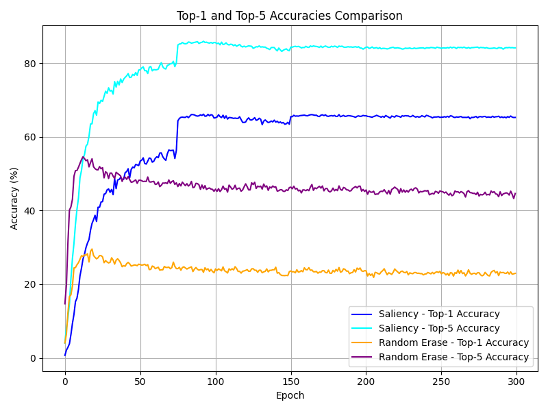
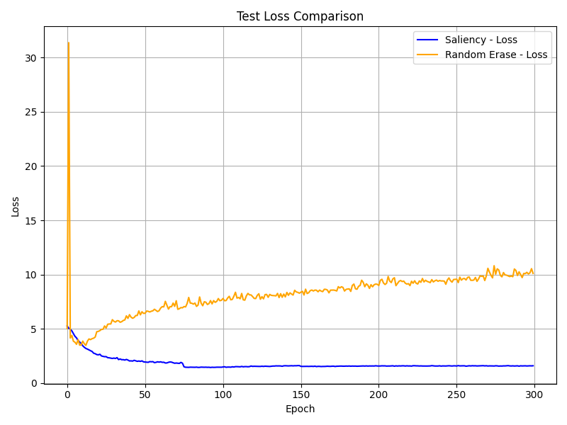

# A Comparative Analysis of Classical and Learning-Based Data Augmentation for Image Classification

This project compares two data augmentation strategies for image classification on Tiny ImageNet:
**SaliencyMix**, a saliency-guided data augmentation method, and **Random Erase**, a classic random occlusion method.

- Both methods are applied to ResNet50 models trained from scratch (no pretrained weights).
- The original SaliencyMix code was adapted from ImageNet to Tiny ImageNet.
- The Random Erase baseline is implemented from scratch, with its core function adapted from the official Random Erase code.
- Evaluation metrics are standardized across both methods for fair comparison.
- Preprocessing:
  - Random Erase uses normalization with ImageNet parameter values.
  - SaliencyMix uses RandomCrop, RandomHorizontalFlip, Jitter, Lighting, and Normalization (from the official SaliencyMix implementation).
- Initialization:
  - SaliencyMix uses He initialization.
  - Random Erase uses Xavier initialization.
- The project includes training scripts, evaluation, and plots comparing accuracy, error, and loss.


---

## Requirements

Environment file provided. Tested on **CUDA 12.6**.

```bash
conda env create -f environment.yml
```

---

## Training

### SaliencyMix

To train ResNet50 on Tiny ImageNet with SaliencyMix and traditional data augmentation:

```bash
python SaliencyMix-ImageNet/train.py \
  --net_type resnet \
  --dataset imagenet \
  --batch_size 256 \
  --lr 0.1 \
  --depth 50 \
  --epochs 300 \
  --expname ResNet50 \
  -j 40 \
  --beta 1.0 \
  --salmix_prob 1.0 \
  --no-verbose > run_job_saliency.log 2>&1
```

### Random Erase

To train ResNet50 on Tiny ImageNet with Random Erase:

```bash
python SaliencyMix-ImageNet/baseline_random_erase/resnet.py > run_job_randomerase.log 2>&1
```

---

## Generate Comparison Plots

```bash
python compare_plots.py
```

---

# Model Performance

## Accuracy Plot



## Error Plot


## Loss Plot



---

## Acknowledgments

- [**SaliencyMix**](https://github.com/afm-shahab-uddin/SaliencyMix)  
- [**Random Erasing**](https://github.com/zhunzhong07/Random-Erasing)
