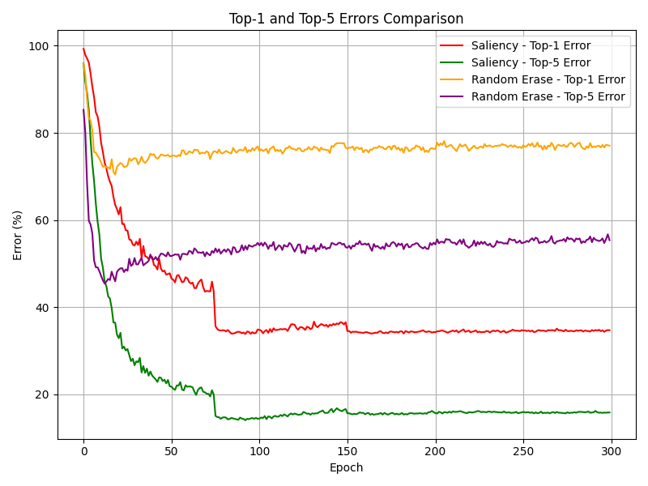

# A Comparative Analysis of Classical and Learning-Based Data Augmentation for Image Classification

## Summary

- **SaliencyMix** is a Saliency Guided Data Augmentation Strategy for Better Regularization.
- The original SaliencyMix code was adapted from ImageNet to Tiny ImageNet.
- The baseline Random Erase is written from scratch; its core function is adapted from the official Random Erase implementation.
- Evaluation metrics for Random Erase were adapted to match those used in SaliencyMix.
- Preprocessing for Random Erase was implemented from scratch using a Normalizing transform with ImageNet parameter values.
- Preprocessing for SaliencyMix includes RandomCrop, RandomHorizontalFlip, Jitter, Lighting, and Normalization (from the official SaliencyMix implementation).
- Both models are trained on ResNet50 for comparison and trained from scratch (without using pretrained ResNet weights).
- SaliencyMix uses He initialization; Random Erase uses Xavier initialization.


---

## Requirements

Environment file provided. Tested on **CUDA 12.6**.

```bash
conda env create -f environment.yml
```

---

## Training

### SaliencyMix

To train ResNet50 on Tiny ImageNet with SaliencyMix and traditional data augmentation:

```bash
python SaliencyMix-ImageNet/train.py \
  --net_type resnet \
  --dataset imagenet \
  --batch_size 256 \
  --lr 0.1 \
  --depth 50 \
  --epochs 300 \
  --expname ResNet50 \
  -j 40 \
  --beta 1.0 \
  --salmix_prob 1.0 \
  --no-verbose > run_job_saliency.log 2>&1
```

### Random Erase

To train ResNet50 on Tiny ImageNet with Random Erase:

```bash
python SaliencyMix-ImageNet/baseline_random_erase/resnet.py > run_job_randomerase.log 2>&1
```

---

## Generate Comparison Plots

```bash
python compare_plots.py
```

---

# Model Performance

## Accuracy Plot


## Error Plot



## Loss Plot


---

## Acknowledgments

- [**SaliencyMix**](https://github.com/afm-shahab-uddin/SaliencyMix)  
- [**Random Erasing**](https://github.com/zhunzhong07/Random-Erasing)
